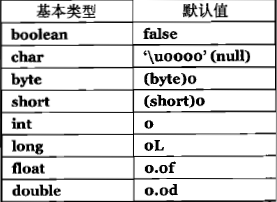

# Think In Java

## CH1

 - 访问权限控制
   - 将开发者分为 `class programmer` 和 `client programmer` 来区分两者的职能
   - `public` `private` `protected` `package`
 - 复用 reuse
   - 组合 composition 就是在类创建的时候就已经 build-in
   - 聚合 aggregation 就是动态组合
 - 继承 inheritance
   - 继承的时候 要清楚自己的基类到底要不要实现一些方法 还是仅仅作为接口的形式出现
     - 比如 shape 里面的 draw 对于每一个实际的图形来说都是不一样的
   - 纯粹代替 就是派生类完全实现基类所有接口(is-a)
   - 而另外一种则是(is-like-a)即在基类基础上额外实现接口
 - 多态 polymorphism
   - 函数非前期绑定(绝对地址) 而是后期绑定(运行的时候决定调用地址)
   - `c++` 使用 `virtual` 关键字来声明动态绑定 `java` 默认动态绑定
   - `upcasting` ( `c++` 里面是 `dynamic_cast` ) 派生类可以自动向上转型 然后在实际使用方法的时候调用自己实现的方法 即不需要通过 `switch-case` 语句去判断其实际上是什么类型
 - 单根继承 所有的都来自于一个叫做 `Object` 的类 `c++` 需要去兼容 `c` 的语法所以其实这方面需要很大的力气 而 `Java` 是从头开始的所以做的比较好
   - 这里主要需要处理的是增加新接口的问题 `Java` 全部来自于一个基类因此方便 但是 `c++` 基于 `c` 因此需要去回到 `c` 里面去重新进行多重继承
   - 参数化类型/泛型/Templates `ArrayList<T>` 
 - 内存分配和生命周期
   - `c++` 需要由程序员选择声明以及存储方式 但是在 `Java` 里面则完全采用动态分配的形式进行 必须使用 `new` 来进行对象的创建
   - 堆栈上创建的变量生命周期可知 堆中的变量生命周期不可知 `c++` 没有垃圾收集 存在内存泄漏 `Java` 虚拟机自带垃圾收集器 处理堆上的单根继承的对象
 - 异常处理 `Java` 强制需要实现对应的异常处理 否则产生编译错误 异常依旧被当做是一个类
 - web
   - 早期使用静态的内容一般使用 `HTML` 语言 通过 `CGI`(common gateway interface) 传递
   - 但是通过 `CGI` 实现的服务器往往存在交互式减慢 因为需要客户机传输信息 服务器处理信息 服务器返回信息 因此需要使用客户端编程
   - 客户端变成可以通过插件的形式实现 也可以通过脚本语言 比如 `Javascript` 优点是易于执行 缺点是人人可见
   - 复杂问题可以通过 `Java` 的 `applet` 来完成 即用户只需要再打开网页的时候下载一个 `applet` 实际上也是 `Java` 的程序进行客户端的相关操作

## CH2 一切皆是对象

 - 操纵方式
   - `c` 和 `c++` 都是用指针的方式来操纵(间接) 而 `Java` 则是直接使用引用(`reference`)的方式
     
        > 比较直接的解释就像是使用遥控器来操作电视机 操纵的目的是电视机 但是实际操作的却是遥控器  
        > 甚至可以你只有遥控器而没有电视机 比如一个纯粹的 `String s`

 - 存储方式
   - **寄存器** 非程序操控 编译器决定
   - **堆栈** RAM 中 知道固定的生命周期
   - **堆** RAM 中 使用 `new` 来新建 自动进行垃圾回收
   - **常量** 一般用 `final` 修饰的那种 ROM 里面
   - **静态存储** 包括 `stream` 和 `数据库`等(后者没成为持久化对象 persistent object)
   - 基本类型 放在对战里面 不用引用(实际上就是一个直接的地址类型)
    
     > 
     > 所有的数据类型都有政府好 `boolean` 没有明确指明大小 只有tf两个值

   - 高精度类型 `BigInteger` 和 `BigDecimal` 没有指定基本类型 算是包装容器类
 - 数组 `Java` 自带范围检查 空值使用 `null` 来进行控制(或者置零) 而且必须初始化
 - 作用域 `Java` 不允许出现下面这样的声明 即没有作用域隐藏

```Java
{
  int x = 1;
  {
    int x = 1; //Illegal
  }
}
```

 - 对象不需要销毁 而是采用垃圾收集器自己进行处理 不像 `c` 和 `c++` 需要由程序员进行销毁 因此超出作用域的对象还会存在直到程序永远不使用为止
 - ***`Class`***
   - `Fields`(`data member`) and `Methods`(`member function`)
   - 基础类的初始化值

     > 
     > 仅限于字段而不适用于局部变量  
     > 即相当于无参构造函数的初始化 非成员未初始化变量会报错

   - 调用方法称为 “给对象发送消息”
   - 方法的标识符是 方法名 + 参数列表 (这就支持了重载)
   - `Java` 在调用函数的时候 基础类型是值传递 非基础类型是值传递
 - `Package` 实际上就相当于一个封装 再加上 命名空间(`namespace`) 使用域名的形式来命名 包名全部用小写
 - `static` 静态
  - 用来解决 比如想给一个 `class` 的所有实例的某一些特殊的域申请共同的存储空间 或者 不创建实例也能够调用方法或者字段(常量)
  - 非 `static` 只能通过实例访问(即和实例相关) 推荐直接用类名来调用 `static` 因为编译器可以做优化
  - 因此 `static` 的方法只能调用 `static` 的变量 而非 `static` 的方法则不受限制
  - 常规的应用可以应用于单例模型或者上锁控制
 - `Javadoc` 用于提取注释生成文档 自定义生成器是 `doclets`
   - 所有的语法都在如下的样式中出现，可以是单行 `Javadoc` 会自动去除行首的空格和星号 只会为 `public` 和 `protected` 的类、成员和方法进行解析注释 生成一个 HTML

```Java
 /** 
  * add your comment here 
  */
// Example:
/** A class comment */
public class Documentation{
  /** A field comment */
  public int i;
  /** A method comment */
  public void f(){}
}
```
   - 最简单的注释就是上面这种 也支持嵌入html 但是不能够加入 \<h\> 或者 \<hr\> 这种标题标签 
   - 可以用带 @ 的标签进行注释 详情可以搜索在线文档

## Ch3 操作符

 - 别名问题 也就是 `class` 类型传递都是引用传递 基础类都是值复制传递 所以要防止引用问题的话 需要使用值拷贝来创建新的对象
 - 数值相关
   - 随机数 `Random rand = new Random(seed)` 取数字 `rand.nextXX()`
   - `+x` 把 `x` 从较小类型提升为 `int`
   - ` == ` 和 `!=` 用于比较对象是否相同而不是内容是否相同 内容比较用 `equals` 如果是自己的类 需要自己重写 `equals` 否则其效果和 `==` 是一样的
   - `Java` 不能够用非 `boolean` 类来产生判定值 比如 `int i && int j` 这种
   - 判断式存在短路现象 因此最好把开关前置
 - 直接常量
```Java
public class Literals{
  /* Integer */
  int i1 = 0x2f;  //Hexadecimal
  int i2 = 0X2f;  //Hexadecimal
  int i3 = 0177;  //Octal
  /* Char */
  char MAX_CHAR = 0xfff;
  /* Byte */
  byte MAX_BYTE = 0x7f;
  /* Short */
  short MAX_SHORT = 0x7fff;
  /* Long */
  long n1 = 100L;
  long n2 = 100l; //It's l NOT 1;
  long n3 = 100;
  // Also can use Hex AND Oct
  /* Float */
  float f1 = 1;
  float f2 = 1F;
  float f3 = 1f;
  /* Double */
  double d1 = 1d;
  double d2 = 1D;
  /* Scientific */
  float f_exp1 = 1.2e-3f;
  float f_exp2 = 4.5E6f;
  double d_exp1 = 1.2e-3d;
  double d_exp2 = 4.5E6;
  // Without sufficient means double
}
```

 - 按位操作 `& | ^ ~` 单目操作符 `boolean` 不能取反
 - 移位操作 `<<` 低位补零 `>>` 保留符号扩展 `>>>` 高位补零
   - byte小类型会转化成 `int` 返回值也是 `int` 移位位数最多 32 位 即后面的数字的最后 5 位 `long` 是 6 位
   - 移位赋值 对小类型 `>>>=` 会产生截断 即先变成 `int` 再赋值回来 因此会出现 负数的情况

```Java
  byte b = -1; // 32 个 1
  b >>>= 10; // 得到 32 个 1
  Integer.toBinaryString(b >>> 10); // 得到 22 个 1
```

 - 三元选择 带返回值 if-else ? :
 - 不带 `sizeof()` 因为在虚拟机之上
 - 第三章最后有运算符的详细介绍

## Ch4 控制执行流程

 - `foreach` 语句： `for(float a : f)`
 - 可以用 `Range()` 函数来创建一些数组 比如 `range(x) range(x,y)` 来使用 `foreach` 语句
 - 无限循环 `while(true)` 或者 `for(;;)`

## Ch5 初始化与清理

 - 函数重载可以构造不同顺序相同类型参数列表是允许的
 - 多重重载的时候
   - 提升类型优先选择最小的范围 常数是 `int` `char` 类型不匹配则选择 `int`
   - 顺序为 `char < byte < short < int < long < float < double` 
   - 窄化类型优先选择最大的
 - 不能根据返回值进行区分 因为可以语句调用
 - 一般不会返回 `this` 指针 除非你要对对象进行继续操作
 - 类内可以用 `this` 来递归调用构造器 优化一些复杂构造器的代码逻辑
   - 比如 `this(int a, String b)` 调用的就是 `class(int a, String b)` 而且只能够在构造函数里面这样使用
   - `this` 不能出现在 `static` 里面 因为它是脱离实例(引用存在的) 而 `this` 需要存在引用才能够调用与有意义
 - 垃圾回收
   - 不同于 `c++` 的析构 `c++` 只要不用某个类的时候或者生命周期结束的时候都会进行析构 但是 `Java` 一般来说不到**内存资源**耗尽的时候是不会进行垃圾回收的 这就意味着 一般你的类都是不会被回收的
   - 垃圾回收的时候会先进行 `class.finalize()` 如果覆盖的话会执行覆盖后的函数 `finalize()` 不执行任何的析构 仅仅是进行一些修复或者恢复操作
   - 一个例子就是 比如某个类在初始化的时候进行了绘制 那么只要它不 `finalize` 那么就会一直存在 如果不手动执行的话 那么就只有在被收集的时候才会 `finalize` 因此绘制得到的就会一直存在 而不像 `c++` 只要析构了就会清除
   - 其存在最主要的就是在 `java` 中比如调用了 `c` 或者 `c++` 等就需要手动进行内存的释放 如果只是调用 `Java` 的类的话是不需要进行释放的
   - 在应用的时候 通过实现 `finalize` 可以来判定某些类的终结条件是否满足 比如 检查是否在销毁对象的时候都满足 `Book.checkOut` 这个条件 一般都是在测试的时候使用而不是实际发行的时候使用 这也可以用于抛出异常来判断一些终结条件 测试的时候可以用 `System.gc()` 来进行强制终结对象进行一些测试
   - `finalize` 一般都需要再继续执行基类的 `finalize`
   - 垃圾回收一般用的是 两个堆 复制销毁的方式 `stop-and-copy` 或者 `mark-and-sweep`(小型垃圾处理)
   - 更进一步可以使用 `generation` 和染色(黑白灰) 来进行垃圾处理
 - 初始化
   - 示例

     > 

   - 允许使用函数来进行初始化
     - `Class c = new Class()`
     - `int i = f()`
     - `int j = g(i)`
     - 但是不允许 `forward reference` 即 `i` 在被引用的时候必须有初值
   - 初始化顺序为 先变量后方法 即在调用构造器之前先进行初值绑定 比如那些 `0` 或者 `null` 安全性保障
   - `static` 优先于其他变量初始化 `static {}` 语句的效果和变量相同 也只有在第一次创建对象的时候执行一次
   - 如果没有 `static` 修饰的 `{}` 会在每次都执行 并且在构造器之前
   - 使用可变参数可以简化数组参数的传递 这里创建的是 `Object` 数组 因此可以实现不同数据类型共存 否则就必须保证输入参数都是确定的数据类型

```Java
public static void printArray(Object... args){
  for(Object obj : args)
    System.out.print(obj + " ");
}
public static void main(){
  printArray(a, b, c, d);
  //而不需要 printArray(new Object[] = {1, 2, 3, 4}); 老式的版本
}
```

   - 枚举类型 可以用 `ordinal()` 来获取声明顺序 需要创建一个实例才能够用

## Ch6 访问权限控制

 - 包
   - 出现类冲突 需要全名
   - 可以用 `import static package.*` 来引入静态方法
   - 可以用 `import` 加上写不同的包来实现条件编译 即 `x_debug` 和 `x_debugoff`
 - 访问控制
   - 没有修饰是包内可访问 `public` 全局可访问 `protected`
   - 没有包头并且处于同一个目录下的话默认当做是 同一个包
   - 使用 `private` 去修饰构造器可以避免外部错误的调用构造器
   - `protected` 具有包内访问权限 也具有继承访问权限 但是不具有 `public` 权限
   - 单例模型

     > 

## Ch7 复用类

 - 使用 `toString()` 来返回指定类的构造出来的字符串
 - 复用的方式有 组合 继承 代理(delegation)
 - 组合
   - 需要注意外部引用类的初始化 因为默认是 `null`
   - 惰性初始化意味着只有在需要的时候才进行初始化 一般放在调用之前一句话
 - 继承
   - 派生类构建的时候是首先从基类开始向外扩展的
   - 如果带参数的话 需要使用 `spuer(args)` 进行向上的构造调用
 - 代理(delegation)
   - 实际上就是一个类似于组合的形式 将底层控制器的接口暴露给高层 代理实现对底层器的调用(类似于 `API` )
 - 注意清理的话最好是自己实现 然后放在 `try` 部分的 `final` 里面进行处理 不要使用 `finalize` 可以用自己写的什么 `dispose` 之类的清除相关痕迹 但是不需要释放对象
 - `@Override` 可以防止在需要进行覆写的时候进行了重载 因为在 `Java` 里面是允许进行派生类重载后仍然可以调用基类的方法
 - `final` 关键字
   - 数据
     - 一般是永不改变的常量 或者在初始化时候的值 `static final` 一般拿来做常量
     - `final` 修饰类变量的时候 类变量不能够进行重新更改引用 但是可以修改其数据域 (包括 `String` 和数组在内)
     - `static final` 无论是不是动态创建的都是一个恒定常量(由 `static` 的特性决定) 但是只是 `final` 的动态常量每一个都可能会不一样
     - 空的 `final` 需要在构造器里面进行初始化
     - `final` 参数不能在内部进行数据修改
  - 方法
    - 两个原因 一是为了锁定方法防止被修改和覆盖(主要是在继承的时候) 而是为了效率 因为会被修改成 `inline` 函数 但也会因为代码膨胀导致效率实际提升并不大 因此现在只有在原因一的时候才进行 `final`
    - 对方法来说 `private` 自带 `final` 属性 派生类所产生的 `public` `protected` 或 `package` 都不会覆写 因此在 `upcasting` 的时候 基类无法进行访问新产生的那些相关函数
    - 只有非 `final` 的方法才可以进行覆写
  - 类
    - 禁止继承 默认所有的域都是 `final` 需要由创建者保证安全性等问题
  - 类的初始化是把其内存地址全部设为 `0` 实现的 非常快

## Ch8 多态 Polymorphism

 - 常规的继承中第一反应是使用派生类的方法去唯一的调用方法
 - 多态允许以基类为接口 调用派生类的方法(即 `Upcasting` 的形式)

```Java
class Base{
  public void f(){}
}

class Derived1 extends Base {
  public void f() { print("D1.f()"); }
}

class Derived2 extends Base {
  public void f() { print("D2.f()"); }
}

public class Test {
  public void fAll(Base[] bTest){
    for(Base b : bTest)
      b.f();
  }

  public static void main(String[] args){
    Base[] bTest = {
      new Derived1(),
      new Derived2(),
    };
    fAll(bTest);
  }
}
```

 - 上述能够实现的根本原因是 后期绑定
   - 前期绑定是指在编译器生成的时候就决定调用方法
   - 后期绑定 或者 动态绑定 是运行时候才进行绑定 实际上就是在每一个对象生成的时候进行绑定 尤其是基类对象却用子类来声明的时候 比如上面
   - `final` 实际上就是关闭了动态绑定
 - `Upcasting` 在继承的时候 要注意同名域不存在继承 私有方法不存在继承 因此也就没有重载和覆写的说法 需要使用 `super` 去显式的调用基类的域
 - `Upcasting` 的时候 静态方法不存在重载 仍旧是基类的方法
 - 构造器
   - 调用顺序 `class` 先于 `class` 内变量 变量先于构造器 基类先于派生类 即先要有对象引用才能有对象域 先要有基类对象才能有派生类对象 先要有对象域才能有构造器初始化
 - 销毁的时候需要由子对象开始 子对象销毁完毕后调用基类的销毁方法 
 - 类中添加 `static` 来完成共享的操作
 - 如果在构造器中调用了方法 但是在派生类中又重写了方法的话会导致派生类的方法动态加载而不能够调用基类的方法 即使使用的是 `this.f()` 调用到的也是派生类的方法 除非是 `final` 和 `private`
 - 子类的覆写还会产生在 返回类型为基类的派生类的方法 即基类的返回为某个 `base` 而 子类的返回类型为那个 `base` 的 `derived`
 - 向上转型会隐藏派生类方法 向下转型会抛出 `ClassCastException` 异常 但是不需要处理

## Ch9 接口 Implements
